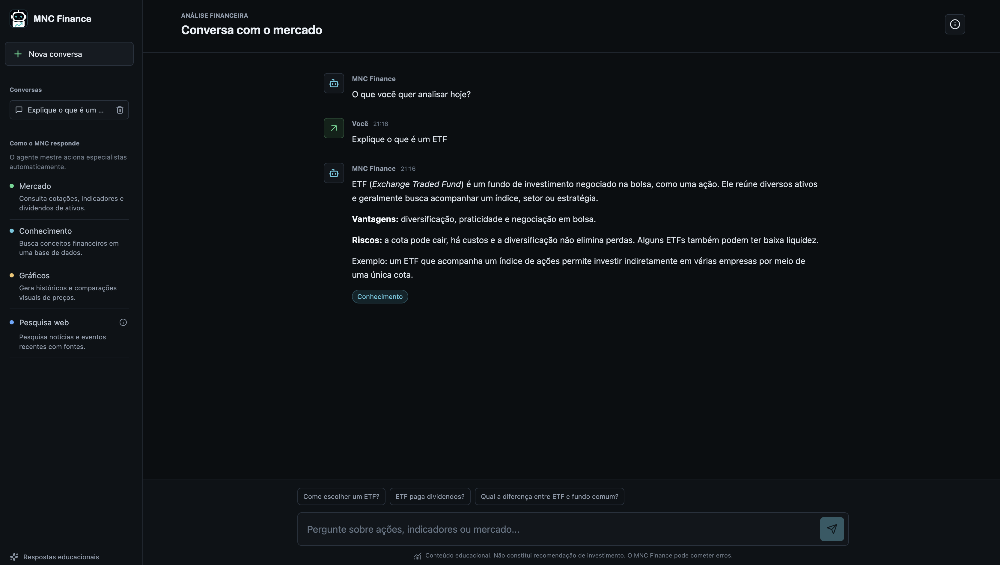
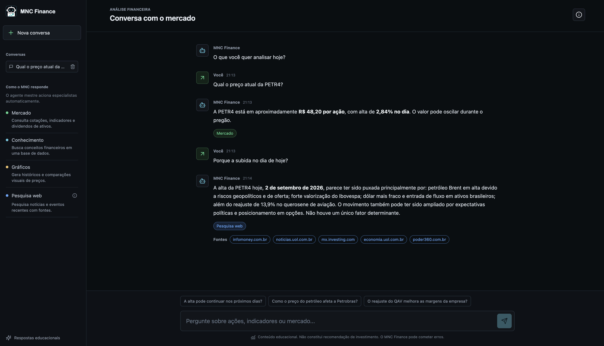
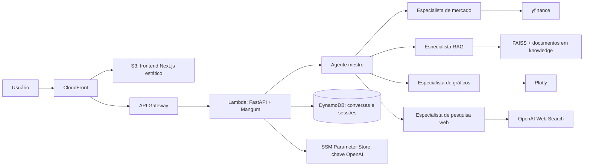

<p align="center">
  
</p>

<h1 align="center">MNC Finance</h1>

<p align="center">
  Chatbot financeiro orientado por agentes de IA, com dados de mercado, RAG, gráficos e pesquisa web.
</p>

<p align="center">
  <a href="https://d1cfe9yo2vzdm0.cloudfront.net">Demo ao vivo</a>
  &nbsp;|&nbsp;
  <a href="#arquitetura">Arquitetura</a>
  &nbsp;|&nbsp;
  <a href="#execução-local">Execução local</a>
  &nbsp;|&nbsp;
  <a href="#deploy">Deploy</a>
</p>

<p align="center">
  
  
  
  
</p>

## Visão geral

O MNC Finance é uma aplicação educacional para explorar ações, ETFs, FIIs, índices e conceitos financeiros em linguagem natural. Um agente mestre interpreta cada pergunta e aciona especialistas quando necessário, reunindo a resposta final com dados, gráficos, fontes ou conteúdo da base de conhecimento.

O projeto foi construído com foco em arquitetura de agentes, experiência de uso e uma infraestrutura serverless simples de operar. Ele não fornece recomendações personalizadas de investimento.

## Principais recursos

- Orquestração por um agente mestre e quatro especialistas: mercado, conhecimento, gráficos e pesquisa web.
- Cotações, indicadores e histórico de dividendos de 12 meses via `yfinance`.
- Gráficos interativos de histórico de preços e comparações entre dois ativos com Plotly.
- RAG com FAISS, embeddings da OpenAI e suporte a documentos Markdown e PDFs com texto selecionável.
- Pesquisa web para eventos, notícias e movimentos de mercado, com fontes exibidas na resposta.
- Guardrail que mantém a conversa no escopo financeiro e evita recomendações personalizadas.
- Perguntas de continuação geradas de acordo com o contexto da última resposta.
- Conversas salvas por navegador, com um identificador anônimo local para separar os históricos entre visitantes.
- Interface responsiva em tema escuro, com histórico de conversas, horários, ferramentas utilizadas e avisos de uso educacional.
- Rate limiting no backend e no API Gateway para reduzir abuso e custo acidental.

## Screenshots

Adicione os seus prints em `docs/screenshots/` usando os nomes abaixo. Os blocos já estão preparados para aparecer nesta seção quando as imagens forem commitadas.

<!--




-->

| Tela | Sugestão de arquivo | O que mostrar |
| --- | --- | --- |
| Início | `docs/screenshots/home.png` | Interface, especialistas e perguntas sugeridas. |
| Análise de ativo | `docs/screenshots/chart-response.png` | Resposta com gráfico, dados de mercado e badges de ferramentas. |
| Pesquisa web | `docs/screenshots/web-research.png` | Resposta com fontes de uma notícia ou evento de mercado. |

## Arquitetura



### Fluxo dos agentes

1. O usuário envia uma pergunta pelo frontend.
2. O agente mestre aplica o guardrail de escopo financeiro e entende a intenção.
3. Quando necessário, ele chama um ou mais especialistas como tools.
4. Os especialistas retornam dados estruturados, contexto recuperado, gráficos ou fontes.
5. O agente mestre produz a resposta final e três perguntas de continuação relevantes.
6. A conversa e seus metadados ficam armazenados no DynamoDB, associados ao identificador anônimo daquele navegador.

## Especialistas

| Especialista | Responsabilidade | Integrações |
| --- | --- | --- |
| Mercado | Consulta cotações, indicadores e dividendos de ativos. | `yfinance` |
| Conhecimento | Busca explicações e conceitos na base documental. | OpenAI Embeddings, FAISS, Markdown e PDF |
| Gráficos | Gera históricos e comparações visuais de preços. | `yfinance`, Plotly |
| Pesquisa web | Investiga fatos, eventos e notícias com fontes atuais. | OpenAI Web Search |

## Stack

| Camada | Tecnologias |
| --- | --- |
| Frontend | Next.js, TypeScript, React, CSS, Lucide, Plotly e React Markdown |
| Backend | Python, FastAPI, Pydantic, OpenAI Agents SDK e Mangum |
| Dados e RAG | `yfinance`, pandas, FAISS, OpenAI Embeddings e PyPDF |
| Persistência | SQLite no desenvolvimento e DynamoDB em produção |
| Infraestrutura | AWS Lambda, API Gateway, ECR, S3, CloudFront, SSM Parameter Store e CloudFormation/SAM |
| Qualidade | Pytest, TypeScript e `uv` para dependências Python |

## Estrutura do repositório

```text
.
├── backend/
│   ├── app/
│   │   ├── agents/          # Agente mestre, especialistas e guardrail
│   │   ├── api/             # Rotas FastAPI
│   │   ├── conversations/   # SQLite, DynamoDB e sessões de agentes
│   │   ├── rag/             # Indexação e recuperação vetorial
│   │   └── tools/           # yfinance e geração de gráficos
│   ├── scripts/             # Script de indexação da base RAG
│   ├── tests/               # Testes automatizados
│   └── Dockerfile           # Imagem para AWS Lambda
├── frontend/
│   ├── app/                 # Aplicação Next.js
│   ├── components/          # Chat, gráficos e histórico de conversas
│   └── public/              # Assets estáticos
├── knowledge/               # Documentos Markdown e PDFs para o RAG
└── template.yaml            # Infraestrutura AWS
```

## Execução local

### Pré-requisitos

- Python 3.11 ou superior
- [uv](https://docs.astral.sh/uv/)
- Node.js 20 ou superior
- Uma chave da API da OpenAI

### 1. Configure o backend

```bash
cd backend
cp .env.example .env
```

Preencha `OPENAI_API_KEY` no arquivo `backend/.env`.

```bash
uv sync --dev
uv run fastapi dev app/main.py
```

A API estará em `http://127.0.0.1:8000`, com documentação interativa em `http://127.0.0.1:8000/docs`.

### 2. Configure o frontend

Em outro terminal:

```bash
cd frontend
npm install
npm run dev
```

O frontend estará em `http://localhost:3000` e, por padrão, se conecta à API local. Para apontar para outra API, crie `frontend/.env.local`:

```bash
NEXT_PUBLIC_API_URL=http://127.0.0.1:8000
```

### 3. Indexe a base RAG

Sempre que adicionar ou alterar documentos em `knowledge/`, reindexe a base:

```bash
cd backend
uv run python -m scripts.build_rag_index
```

Markdown e PDFs com texto selecionável são suportados. PDFs digitalizados exigem OCR e não fazem parte desta versão.

## Testes e verificações

```bash
# Backend
cd backend
uv run pytest

# Frontend
cd frontend
npm run typecheck
npm run build
```

## Deploy

O deploy de produção usa uma arquitetura serverless na AWS:

- O backend é empacotado como imagem Docker e executado no AWS Lambda.
- A imagem fica no Amazon ECR.
- O API Gateway publica a API HTTPS e aplica limites de requisição.
- O frontend é exportado estaticamente para um bucket S3 privado e entregue pelo CloudFront.
- O DynamoDB armazena conversas e sessões dos agentes.
- A chave da OpenAI fica protegida no AWS Systems Manager Parameter Store, sem ser versionada no repositório.
- O arquivo [`template.yaml`](template.yaml) define a infraestrutura como código.

Para uma nova versão, o fluxo é:

1. Reindexar o RAG quando `knowledge/` mudar.
2. Gerar e enviar a imagem Linux para o ECR.
3. Atualizar a stack CloudFormation com a nova imagem.
4. Gerar o export estático do frontend com `NEXT_PUBLIC_API_URL` da API publicada.
5. Sincronizar `frontend/out/` com o bucket S3 e invalidar o cache do CloudFront.

## Limites e aviso

O MNC Finance é uma ferramenta educacional. As informações podem estar desatualizadas, conter erros ou depender da disponibilidade de fontes externas. Nenhuma resposta constitui recomendação de investimento, análise individual ou promessa de retorno.

## Licença

Este projeto foi desenvolvido para fins educacionais e de portfólio. Defina uma licença antes de reutilizar ou distribuir o código publicamente.
